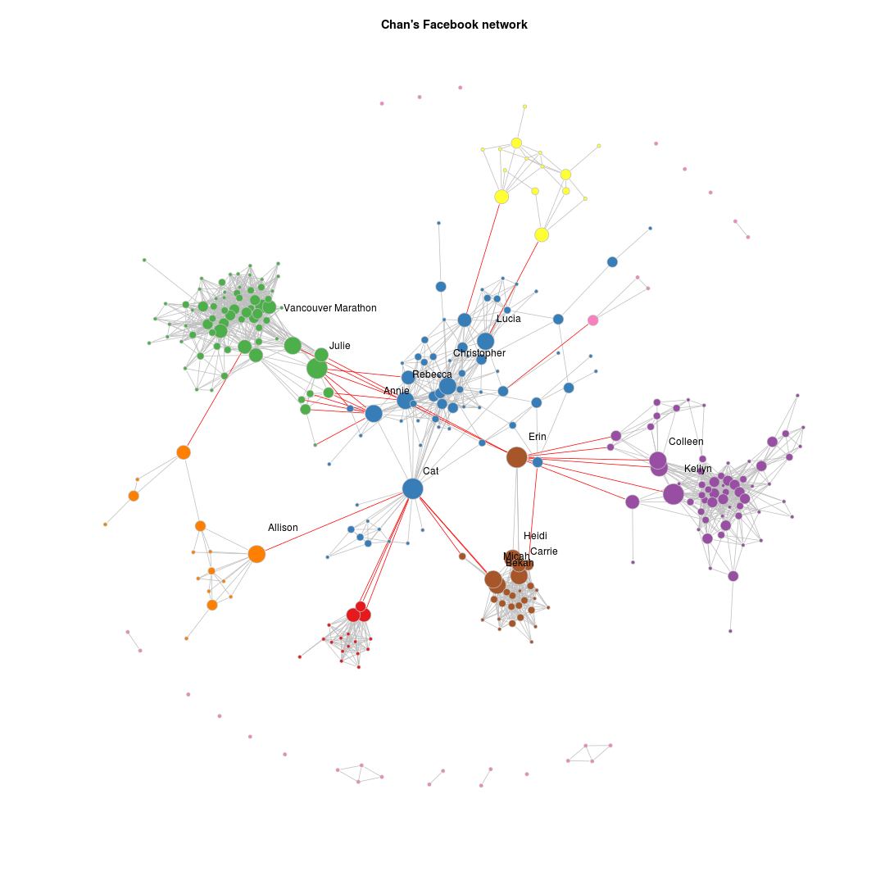

My Facebook network
===================
Build off of the first assignment from the Coursera Social Network Analysis course. Below are part of the instructions from the first assignment from that course. After downloading my Facebook network data, I examine centrality and communities in the network using `R version 2.15.1 (2012-06-22)` with the `igraph` package. I used the RStudio IDE with Knitr to generate this HTML file. This analysis was run on `2012-11-09 21:44:59`.


Getting Facebook network data
-----------------------------
The following are instructions for downloading my own GML file is below. These instructions were taken from assignment 1 from the fall 2012 Coursera Social Network Analysis course.

> In order to get your own network, complete the following steps:
>
> * Go to [http://snacourse.com/getnet](http://snacourse.com/getnet)
> * Choose which user data (e.g. "wall posts count") you'd like to include, for this assignment no additional data is necessary, but whatever you do download, you can visualize/analyze (profile age rank: oldest profile = highest value, declarative intensity (length of text in fields like activities, books, etc.)
> * Save the .gml file and load it into Gephi using "File -> Open...".

Load required packages.

```r
require(igraph, quietly = TRUE)
require(ggplot2, quietly = TRUE)
require(xtable, quietly = TRUE)
require(RColorBrewer, quietly = TRUE)
```


My GML file was last downloaded on November 6, 2012.

```r
FB <- read.graph(file = "ChanFacebook.gml", format = "gml")
```

As of that date, there are `308` nodes.

Create first name and initials vectors from names. I'll want to use these to label nodes when plotting the network.

```r
listName <- strsplit(V(FB)$label, " ")
nameF <- sapply(listName, head, 1)
nameL <- sapply(listName, tail, 1)
initF <- substr(nameF, 1, 1)
initL <- substr(nameL, 1, 2)
initials <- paste(initF, initL, sep = "")
label <- nameF
```


Analysis questions
------------------
I'm interested in two questions:
* What communities exist in my network?
* Who are the people who are "bridges" across communities?


Centrality
----------
Here's a link to [Wikipedia](http://en.wikipedia.org/wiki/Centrality) for some background information on centrality.

Calculate **degree** centrality. This ends up not being too useful. Degree is really just a measure of how connected someone is. In Facebook terms, it's who has the most friends within my network.

```r
deg <- degree(FB)
summary(deg)
```

```
##    Min. 1st Qu.  Median    Mean 3rd Qu.    Max. 
##     0.0     4.0     8.0    10.9    16.0    42.0
```

The median degree, or number of friends, was `8`. The highest number of friends a person in my network has was `42`.

Even though I don't want to focus on degree centrality, let's see who are the most connected people in my network.

```r
lim <- sort(deg, decreasing = TRUE)[round(vcount(FB) * 0.05)]
top <- data.frame(Name = V(FB)$label, Degree = deg)
top <- subset(top, deg >= lim)
top <- top[order(top$Degree, decreasing = TRUE), ]
print(xtable(top, digits = 0), type = "html", include.rownames = FALSE)
```

<!-- html table generated in R 2.15.1 by xtable 1.7-0 package -->
<!-- Fri Nov  9 21:45:02 2012 -->
<TABLE border=1>
<TR> <TH> Name </TH> <TH> Degree </TH>  </TR>
  <TR> <TD> Rainshadow Running </TD> <TD align="right"> 42 </TD> </TR>
  <TR> <TD> Glenn Tachiyama </TD> <TD align="right"> 42 </TD> </TR>
  <TR> <TD> Steve Walters </TD> <TD align="right"> 37 </TD> </TR>
  <TR> <TD> Terry Sentinella </TD> <TD align="right"> 37 </TD> </TR>
  <TR> <TD> Alvin Crain </TD> <TD align="right"> 36 </TD> </TR>
  <TR> <TD> Christopher J. Barker </TD> <TD align="right"> 34 </TD> </TR>
  <TR> <TD> Hal Gensler </TD> <TD align="right"> 33 </TD> </TR>
  <TR> <TD> Eric Barnes </TD> <TD align="right"> 32 </TD> </TR>
  <TR> <TD> Kim Huynh </TD> <TD align="right"> 31 </TD> </TR>
  <TR> <TD> Daniel Cohen </TD> <TD align="right"> 31 </TD> </TR>
  <TR> <TD> Craig Dickson </TD> <TD align="right"> 30 </TD> </TR>
  <TR> <TD> Ankit Upadhyayula </TD> <TD align="right"> 30 </TD> </TR>
  <TR> <TD> Steven Yee </TD> <TD align="right"> 30 </TD> </TR>
  <TR> <TD> Charles Replogle </TD> <TD align="right"> 30 </TD> </TR>
  <TR> <TD> Cat Buckley </TD> <TD align="right"> 29 </TD> </TR>
  <TR> <TD> Christina Hsu </TD> <TD align="right"> 29 </TD> </TR>
   </TABLE>


Calculate **closeness** centrality. Closeness is a measure of how many steps are required to access every other node. It's a measure of how close a node is to all the action. A person with high closeness, however, doesn't necessarily have to have very many friends or be in between relationship.

```r
close <- closeness(FB)
summary(close)
```

```
##     Min.  1st Qu.   Median     Mean  3rd Qu.     Max. 
## 1.06e-05 1.02e-04 1.04e-04 9.56e-05 1.05e-04 1.08e-04
```

Again, I don't want to focus on closeness centrality since it's not really what I'm after in this analysis, so I won't say anything more about it.

Calculate **betweenness** centrality. I'm going to focus on betweenness since it's going to get after one of my analysis questions, who are the "bridges" between people and communities? Betweenness is a measure of how often a node is in the pathway between two other nodes. I.e., a person with high betweenness can be a key player in introducing a large group of friends to another large group of friends. Such a person doesn't necessarily have to have a large number of friends themselves. But they could be in a unique position of influence in the network.

Plot a histogram of betweenness scores. 

```r
btwn <- betweenness(FB)
summary(btwn)
```

```
##    Min. 1st Qu.  Median    Mean 3rd Qu.    Max. 
##       0       0      23     478     255   15800
```

```r
qplot(btwn, binwidth = 1000)
```

 

The absolute value of the scores don't mean much. But their relative values tell the story. There are a number of people with extremely high betweenness scores. Who are these people? List the 5% of people with the highest betweeness scores. The labels will annotate the network visualization.

```r
lim <- sort(btwn, decreasing = TRUE)[round(vcount(FB) * 0.05)]
top <- data.frame(Name = V(FB)$label, Betweenness = btwn)
top <- subset(top, btwn >= lim)
top <- top[order(top$Betweenness, decreasing = TRUE), ]
print(xtable(top, digits = 0), type = "html", include.rownames = FALSE)
```

<!-- html table generated in R 2.15.1 by xtable 1.7-0 package -->
<!-- Fri Nov  9 21:45:05 2012 -->
<TABLE border=1>
<TR> <TH> Name </TH> <TH> Betweenness </TH>  </TR>
  <TR> <TD> Cat Buckley </TD> <TD align="right"> 15828 </TD> </TR>
  <TR> <TD> Erin 'Davis' Thekkedom </TD> <TD align="right"> 15413 </TD> </TR>
  <TR> <TD> Julie Honse </TD> <TD align="right"> 6357 </TD> </TR>
  <TR> <TD> Kellyn Christison </TD> <TD align="right"> 5524 </TD> </TR>
  <TR> <TD> Micah Wiese </TD> <TD align="right"> 5250 </TD> </TR>
  <TR> <TD> Vancouver Marathon </TD> <TD align="right"> 5069 </TD> </TR>
  <TR> <TD> Carrie Kosky Yerton </TD> <TD align="right"> 4852 </TD> </TR>
  <TR> <TD> Bekah Wolf </TD> <TD align="right"> 4207 </TD> </TR>
  <TR> <TD> Rebecca Ettlinger Waltz </TD> <TD align="right"> 3799 </TD> </TR>
  <TR> <TD> Christopher J. Barker </TD> <TD align="right"> 3738 </TD> </TR>
  <TR> <TD> Lucia Longoria </TD> <TD align="right"> 3696 </TD> </TR>
  <TR> <TD> Annie Bencomo </TD> <TD align="right"> 3385 </TD> </TR>
  <TR> <TD> Heidi Baney </TD> <TD align="right"> 3235 </TD> </TR>
  <TR> <TD> Colleen Schoonover </TD> <TD align="right"> 2710 </TD> </TR>
  <TR> <TD> Allison Cox </TD> <TD align="right"> 2584 </TD> </TR>
   </TABLE>


Plot the association between degree centrality and betweenness centrality. See if there are any highly influential people (betweenness) who also have a high number of friends (degree).

```r
rsq <- format(cor(deg, btwn)^2, digits = 3)
cntrl <- data.frame(deg, btwn, close)
ggplot(cntrl, aes(x = deg, y = btwn)) + geom_jitter(alpha = 1/2) + scale_y_log10() + 
    labs(x = "Degree", y = "Betweenness") + annotate("text", label = paste("R-sq =", 
    rsq), x = 30, y = 1)
```

 


Communities
-----------
Find communities using the edge betweenness algorithm.

```r
comm <- edge.betweenness.community(FB)
sizes(comm)
```

```
## Community sizes
##  1  2  3  4  5  6  7  8  9 10 11 12 13 14 15 16 17 18 19 20 21 22 23 24 25 
## 17 70 71 62 15 15 28  1  2  2  4  2  1  1  4  2  1  3  1  1  1  1  1  1  1
```

```r
ncomm <- length(sizes(comm)[sizes(comm) > 4])
```

There are `7` clearly large communities in my network.


Visualize the network
---------------------
Label the nodes with high betweenness centrality.

```r
topnodes <- nameF
topnodes[btwn < lim] <- NA
topnodes[topnodes == "Vancouver"] <- "Vancouver Marathon"
```

Scale the size of a node's plotting symbol according to its betweenness centrality score. Scaling is by percentile (50%, 75%, 90%, 95%, 99%).

```r
q <- quantile(btwn, probs = c(0, 0.5, 0.75, 0.9, 0.95, 0.99, 1))
size <- cut(btwn, breaks = q, include.lowest = TRUE, dig.lab = 5)
summary(size)
```

```
##      [0,22.662] (22.662,254.77] (254.77,1225.1] (1225.1,2500.9] 
##             154              77              46              15 
## (2500.9,5504.3]  (5504.3,15828] 
##              12               4
```

```r
V(FB)$size <- unclass(size)
```


Plot the network and color-code the communities.

```r
id <- communities(comm)[1:ncomm]
palette <- brewer.pal(ncomm + 1, "Set1")
node.color <- c(palette[1:ncomm], rep(palette[ncomm + 1], max(comm$membership) - 
    ncomm))
plot(comm, FB, main = "Chan's Facebook network", vertex.label = topnodes, vertex.label.color = "black", 
    vertex.label.dist = 0.5, vertex.label.family = "sans", vertex.frame.color = "gray", 
    colbar = node.color, mark.groups = id, mark.col = NA, edge.color = c("gray", 
        "red")[crossing(comm, FB) + 1])
```

 

Just eyeballing these communities, here's what I'm seeing:
* The blue community is a core group of friends
  * This is a diverse group, reflecting the many ways I'm connected to them
  * One of the subgroups that's connected to the rest of the blue community through Cat isn't really a group of friends; they're folks on Cat's side of the family
* The purple community is [Union High School](https://www.facebook.com/pages/Union-High-School/127917213038)
  * Within the Union community, the smaller teacher subgroup is apparent and distinct from the larger student subgroup
  * There are a few [Mountain View](https://www.facebook.com/GoThunder.org) students in this community who are connected to Union people
  * The only connection between the Union community and the rest of my network is through Erin; without Erin, my Union community would be totally separated from the rest of my network
* The green community is running friends, including [Marathon Maniacs](http://www.marathonmaniacs.com/), ultra friends, and races
  * My 2011 Hood to Coast team is quite far away from the bulk of my running community; in fact, they are more closely aligned with my core friend community, the reason I got connected to that Hood to Coast team
* The brown community is the [Concordia MATE](http://www.cu-portland.edu/coe/graduate/mat/) cohort
* The red community is family
* The orange community is a secondary group of Portland friends which have ties to the OHSU BMU
* The yellow community is the OHSU BICC group
* There are a few people who don't fit in with a larger community within my network (pink nodes)

It's obvious from the plot and the betweenness scores that Cat and Erin are crucial bridges tying a few large communities together.
