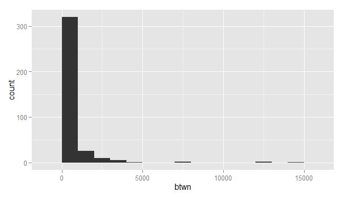
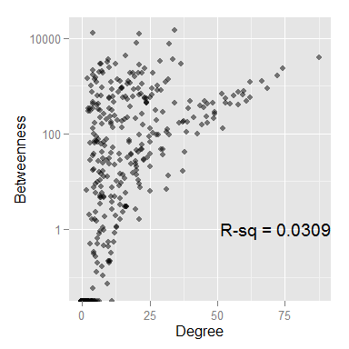
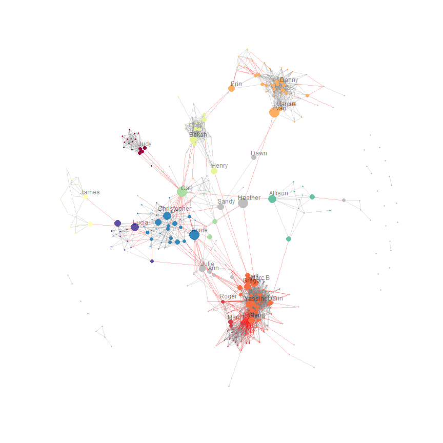

# My Facebook network
Benjamin Chan (https://www.facebook.com/benjamin.ks.chan)  
  
Build off of the first assignment from the Coursera Social Network Analysis course. Below are part of the instructions from the first assignment from that course. After downloading my Facebook network data, I examine centrality and communities in the network using R version 3.1.1 (2014-07-10) with the `igraph` package. I used the RStudio IDE with Knitr to generate this HTML file. This analysis was run on 2014-10-08 09:48:41.


Getting Facebook network data
-----------------------------
The following are instructions for downloading my own GML file is below. These instructions were taken from assignment 1 from the fall 2012 Coursera Social Network Analysis course.

> In order to get your own network, complete the following steps:
>
> * Go to [http://snacourse.com/getnet](http://snacourse.com/getnet)
> * Choose which user data (e.g. "wall posts count") you'd like to include, for this assignment no additional data is necessary, but whatever you do download, you can visualize/analyze (profile age rank: oldest profile = highest value, declarative intensity (length of text in fields like activities, books, etc.)
> * Save the .gml file and load it into Gephi using "File -> Open...".

Read the GML file.

```r
setwd("~/GitHub repositories/FacebookNetworkAnalysis")
require(igraph, quietly=TRUE)
G <- read.graph(file="ChanFacebook.gml", format="gml")
```
My GML file was last modified on 2014-10-08 08:22:48. As of that date, there are 367 nodes.

Create first name and initials vectors from names. I'll want to use these to label nodes when plotting the network.

```r
listName <- strsplit(V(G)$label, " ")
nameF <- sapply(listName, head, 1)
nameL <- sapply(listName, tail, 1)
initF <- substr(nameF, 1, 1)
initL <- substr(nameL, 1, 1)
initials <- paste0(initF, initL)
label <- nameF
head(label)
```

```
## [1] "Christopher" "David"       "Kati"        "Carla"       "Kevin"      
## [6] "Jeff"
```


Analysis questions
------------------
I'm interested in two questions:
* What communities exist in my network?
* Who are the people who are "bridges" across communities?


Centrality
----------
Here's a link to [Wikipedia](http://en.wikipedia.org/wiki/Centrality) for some background information on centrality.

Calculate **degree** centrality. This ends up not being too useful. Degree is really just a measure of how connected someone is. In Facebook terms, it's who has the most friends within my network.

```r
deg <- degree(G)
summary(deg)
```

```
##    Min. 1st Qu.  Median    Mean 3rd Qu.    Max. 
##     0.0     4.0    11.0    15.7    22.0    88.0
```
The median degree, or number of friends, was 11. The highest number of friends a person in my network has was 88.

Even though I don't want to focus on degree centrality, let's see who are the most connected people in my network.

```r
require(xtable, quietly=TRUE)
lim <- sort(deg, decreasing=TRUE)[round(vcount(G) * 0.05)]
top <- data.frame("Name"=V(G)$label, "Degree"=deg)
top <- subset(top, deg >= lim)
top <- top[order(top$Degree, decreasing=TRUE),]
print(xtable(top, digits=0), type="html", include.rownames=FALSE)
```

<!-- html table generated in R 3.1.1 by xtable 1.7-3 package -->
<!-- Wed Oct 08 09:48:41 2014 -->
<TABLE border=1>
<TR> <TH> Name </TH> <TH> Degree </TH>  </TR>
  <TR> <TD> Yassine Diboun </TD> <TD align="right"> 88 </TD> </TR>
  <TR> <TD> Glenn Tachiyama </TD> <TD align="right"> 74 </TD> </TR>
  <TR> <TD> Todd Janssen </TD> <TD align="right"> 72 </TD> </TR>
  <TR> <TD> Jason Leman </TD> <TD align="right"> 68 </TD> </TR>
  <TR> <TD> Charles Replogle </TD> <TD align="right"> 66 </TD> </TR>
  <TR> <TD> Willie McBride </TD> <TD align="right"> 62 </TD> </TR>
  <TR> <TD> Paul Nelson </TD> <TD align="right"> 62 </TD> </TR>
  <TR> <TD> Jennifer Love </TD> <TD align="right"> 61 </TD> </TR>
  <TR> <TD> Sarah Duncan </TD> <TD align="right"> 60 </TD> </TR>
  <TR> <TD> Samantha de la Vega </TD> <TD align="right"> 59 </TD> </TR>
  <TR> <TD> Anne Crispino-Taylor </TD> <TD align="right"> 58 </TD> </TR>
  <TR> <TD> Trevor Hostetler </TD> <TD align="right"> 58 </TD> </TR>
  <TR> <TD> Kevin Karr </TD> <TD align="right"> 56 </TD> </TR>
  <TR> <TD> Larry Stephens </TD> <TD align="right"> 55 </TD> </TR>
  <TR> <TD> Cheri Redwine </TD> <TD align="right"> 53 </TD> </TR>
  <TR> <TD> Renee Seker </TD> <TD align="right"> 53 </TD> </TR>
  <TR> <TD> T.J. Ford </TD> <TD align="right"> 52 </TD> </TR>
  <TR> <TD> Moe Codino </TD> <TD align="right"> 52 </TD> </TR>
   </TABLE>

Calculate **closeness** centrality. Closeness is a measure of how many steps are required to access every other node. It's a measure of how close a node is to all the action. A person with high closeness, however, doesn't necessarily have to have very many friends or be in between relationship.

```r
close <- closeness(G)
summary(close)
```

```
##     Min.  1st Qu.   Median     Mean  3rd Qu.     Max. 
## 7.44e-06 8.63e-05 8.85e-05 8.22e-05 8.94e-05 9.17e-05
```
Again, I don't want to focus on closeness centrality since it's not really what I'm after in this analysis, so I won't say anything more about it.

Calculate **betweenness** centrality. I'm going to focus on betweenness since it's going to get after one of my analysis questions, who are the "bridges" between people and communities? Betweenness is a measure of how often a node is in the pathway between two other nodes. I.e., a person with high betweenness can be a key player in introducing a large group of friends to another large group of friends. Such a person doesn't necessarily have to have a large number of friends themselves. But they could be in a unique position of influence in the network.

Plot a histogram of betweenness scores. 

```r
require(ggplot2, quietly=TRUE)
btwn <- betweenness(G)
summary(btwn)
```

```
##    Min. 1st Qu.  Median    Mean 3rd Qu.    Max. 
##       0       1      40     512     445   14600
```

```r
qplot(btwn, binwidth=1000)
```

 
The absolute value of the scores don't mean much. But their relative values tell the story. There are a number of people with extremely high betweenness scores. Who are these people? List the 25 of people with the highest betweeness scores.

```r
rank <- length(btwn) - rank(btwn) + 1
top <- data.frame("Rank"=rank, "Name"=V(G)$label, "Betweenness"=btwn)
lim <- sort(btwn, decreasing=TRUE)[round(vcount(G) * 0.05)]
# top <- subset(top, btwn >= lim)
top <- subset(top, rank <= 25)
top <- top[order(top$Betweenness, decreasing=TRUE),]
print(xtable(top, digits=0), type="html")
```

<!-- html table generated in R 3.1.1 by xtable 1.7-3 package -->
<!-- Wed Oct 08 09:48:41 2014 -->
<TABLE border=1>
<TR> <TH>  </TH> <TH> Rank </TH> <TH> Name </TH> <TH> Betweenness </TH>  </TR>
  <TR> <TD align="right"> 61 </TD> <TD align="right"> 1 </TD> <TD> Cat Buckley </TD> <TD align="right"> 14597 </TD> </TR>
  <TR> <TD align="right"> 149 </TD> <TD align="right"> 2 </TD> <TD> Heather Fowler </TD> <TD align="right"> 12517 </TD> </TR>
  <TR> <TD align="right"> 293 </TD> <TD align="right"> 3 </TD> <TD> Evan Freeman </TD> <TD align="right"> 12175 </TD> </TR>
  <TR> <TD align="right"> 166 </TD> <TD align="right"> 4 </TD> <TD> Annie Bencomo </TD> <TD align="right"> 7904 </TD> </TR>
  <TR> <TD align="right"> 82 </TD> <TD align="right"> 5 </TD> <TD> Marc Baumgartner </TD> <TD align="right"> 7411 </TD> </TR>
  <TR> <TD align="right"> 87 </TD> <TD align="right"> 6 </TD> <TD> Lucia Longoria </TD> <TD align="right"> 4275 </TD> </TR>
  <TR> <TD align="right"> 60 </TD> <TD align="right"> 7 </TD> <TD> Yassine Diboun </TD> <TD align="right"> 3876 </TD> </TR>
  <TR> <TD align="right"> 197 </TD> <TD align="right"> 8 </TD> <TD> Christopher J. Barker </TD> <TD align="right"> 3654 </TD> </TR>
  <TR> <TD align="right"> 189 </TD> <TD align="right"> 9 </TD> <TD> Allison Cox </TD> <TD align="right"> 3609 </TD> </TR>
  <TR> <TD align="right"> 6 </TD> <TD align="right"> 10 </TD> <TD> Jeff Waskowiak </TD> <TD align="right"> 3260 </TD> </TR>
  <TR> <TD align="right"> 331 </TD> <TD align="right"> 11 </TD> <TD> Henry Barrera </TD> <TD align="right"> 3160 </TD> </TR>
  <TR> <TD align="right"> 108 </TD> <TD align="right"> 12 </TD> <TD> Julie Honse </TD> <TD align="right"> 2928 </TD> </TR>
  <TR> <TD align="right"> 310 </TD> <TD align="right"> 13 </TD> <TD> Erin 'Davis' Thekkedom </TD> <TD align="right"> 2864 </TD> </TR>
  <TR> <TD align="right"> 221 </TD> <TD align="right"> 14 </TD> <TD> Sandy Bacharach </TD> <TD align="right"> 2841 </TD> </TR>
  <TR> <TD align="right"> 183 </TD> <TD align="right"> 15 </TD> <TD> Gregory Gourdet </TD> <TD align="right"> 2815 </TD> </TR>
  <TR> <TD align="right"> 177 </TD> <TD align="right"> 16 </TD> <TD> Johnny Buell </TD> <TD align="right"> 2810 </TD> </TR>
  <TR> <TD align="right"> 214 </TD> <TD align="right"> 17 </TD> <TD> Fernando Viciconte </TD> <TD align="right"> 2385 </TD> </TR>
  <TR> <TD align="right"> 171 </TD> <TD align="right"> 18 </TD> <TD> Glenn Tachiyama </TD> <TD align="right"> 2356 </TD> </TR>
  <TR> <TD align="right"> 21 </TD> <TD align="right"> 19 </TD> <TD> Bekah Wolf </TD> <TD align="right"> 2299 </TD> </TR>
  <TR> <TD align="right"> 19 </TD> <TD align="right"> 20 </TD> <TD> Alex Asselin </TD> <TD align="right"> 2102 </TD> </TR>
  <TR> <TD align="right"> 18 </TD> <TD align="right"> 21 </TD> <TD> James Wallace </TD> <TD align="right"> 2006 </TD> </TR>
  <TR> <TD align="right"> 241 </TD> <TD align="right"> 22 </TD> <TD> Nancy Lee </TD> <TD align="right"> 1935 </TD> </TR>
  <TR> <TD align="right"> 239 </TD> <TD align="right"> 23 </TD> <TD> Darin Swanson </TD> <TD align="right"> 1877 </TD> </TR>
  <TR> <TD align="right"> 49 </TD> <TD align="right"> 24 </TD> <TD> Carrie Kosky Yerton </TD> <TD align="right"> 1865 </TD> </TR>
  <TR> <TD align="right"> 244 </TD> <TD align="right"> 25 </TD> <TD> Ann Wallace </TD> <TD align="right"> 1839 </TD> </TR>
   </TABLE>

Plot the association between degree centrality and betweenness centrality. See if there are any highly influential people (betweenness) who also have a high number of friends (degree).

```r
rsq <- format(cor(deg, btwn) ^2, digits=3)
cntrl <- data.frame(deg, btwn, close)
ggplot(cntrl, aes(x=deg, y=btwn)) +
  geom_jitter(alpha=1/2) +
  scale_y_log10() +
  labs(x="Degree", y="Betweenness") +
  annotate("text", label=paste("R-sq =", rsq), x=+Inf, y=1, hjust=1)
```

 


Communities
-----------
Find communities using the edge betweenness algorithm.

```r
C <- edge.betweenness.community(G)
sizesOrdered <- sizes(C)[order(sizes(C), decreasing=TRUE)]
sizesOrdered
```

```
## Community sizes
##  5  6 15  4 10  1  9 11 17 13  7 18  8 20 36  2 14 21 25 28 29 31 45 46  3 
## 80 50 35 28 27 18 14 13 12 11  7  5  4  4  4  3  2  2  2  2  2  2  2  2  1 
## 12 16 19 22 23 24 26 27 30 32 33 34 35 37 38 39 40 41 42 43 44 47 48 49 50 
##  1  1  1  1  1  1  1  1  1  1  1  1  1  1  1  1  1  1  1  1  1  1  1  1  1 
## 51 52 53 54 55 56 57 58 59 60 
##  1  1  1  1  1  1  1  1  1  1
```

```r
maxComm <- 11
commThreshold <- sizesOrdered[maxComm]
```
There are 11 clearly large communities in my network. *Large* is defined as having more than 7 people.

Set the 12 community as a *junk* community.


```r
C$membership[!(C$membership %in% as.numeric(names(sizesOrdered[1:maxComm])))] <- 999
C$membership <- unclass(factor(C$membership))
table(C$membership)
```

```
## 
##  1  2  3  4  5  6  7  8  9 10 11 12 
## 18 28 80 50  7 14 27 13 11 35 12 72
```


Visualize the network
---------------------

Scale the size of a node's plotting symbol according to its betweenness centrality score. Scaling is by percentile (75%, 90%, 95%, 97.5%, 99%).

```r
q <- quantile(btwn, probs=c(0, 0.75, 0.9, 0.95, 0.975, 0.99, 1))
size <- cut(btwn, breaks=q, include.lowest=TRUE, dig.lab=5)
summary(size)
```

```
##      [0,445.18] (445.18,1255.2] (1255.2,2239.7] (2239.7,3244.8] 
##             275              55              18               9 
## (3244.8,7578.3]  (7578.3,14597] 
##               6               4
```

```r
V(G)$size <- unclass(size)
```

Label the nodes with the top betweenness centrality within each community. This will help make sense of who are the important links between each community.

```r
labNode <- nameF
labNode[labNode == "Marc"] <- paste(labNode[labNode == "Marc"], initL[labNode == "Marc"])  # Since there's 2 Marcs, paste their last initial to the label
rankWithin <- ave(btwn, C$membership, FUN=function(x) length(x) - rank(x) + 1)
pctWithin <- 7
topWithin <- round(pctWithin / 100 * sizes(C))
message(sprintf("The top %3.1f%% within each community leads to labelling %2.0f nodes.", pctWithin, sum(topWithin)))
```

```
## The top 7.0% within each community leads to labelling 26 nodes.
```

```r
# Need to find a more elegant way to do this
isLabelled1  <- C$membership ==  1 & rankWithin <= topWithin[ 1]
isLabelled2  <- C$membership ==  2 & rankWithin <= topWithin[ 2]
isLabelled3  <- C$membership ==  3 & rankWithin <= topWithin[ 3]
isLabelled4  <- C$membership ==  4 & rankWithin <= topWithin[ 4]
isLabelled5  <- C$membership ==  5 & rankWithin <= topWithin[ 5]
isLabelled6  <- C$membership ==  6 & rankWithin <= topWithin[ 6]
isLabelled7  <- C$membership ==  7 & rankWithin <= topWithin[ 7]
isLabelled8  <- C$membership ==  8 & rankWithin <= topWithin[ 8]
isLabelled9  <- C$membership ==  9 & rankWithin <= topWithin[ 9]
isLabelled10 <- C$membership == 10 & rankWithin <= topWithin[10]
isLabelled11 <- C$membership == 11 & rankWithin <= topWithin[11]
isLabelled12 <- C$membership == 12 & rankWithin <= topWithin[12]
isLabelled <- isLabelled1 | isLabelled2 | isLabelled3 | isLabelled4 | isLabelled5 | isLabelled6 | isLabelled7 | isLabelled8 | isLabelled9 | isLabelled10 | isLabelled11 | isLabelled12
labNode[!isLabelled] <- NA
# labNode[C$membership != 5 & nameF != "Cat"] <- NA
```

Create a function for `plot.igraph`.

```r
P <- function(vertex.label.cex=1, vertex.label.color="#0000007F") {
  set.seed(seed)
  plot(C, G,
       vertex.label=labNode, 
       vertex.label.color=vertex.label.color,
       vertex.label.dist=1/4,
       vertex.label.family="sans",
       vertex.label.cex=vertex.label.cex, 
       vertex.frame.color=NA,
       colbar=node.color,
       mark.groups=NA, 
       mark.col=NA,
       mark.border=palette,
       edge.color=c("gray", "red")[crossing(C, G)+1],
       edge.width=1/2
       )
}
```

Show low resolution plot for HTML file. Set the random number seed so when a high resolution version is created, it will have the same layout as this version.

```r
id <- communities(C)[1:maxComm]
require(RColorBrewer, quietly=TRUE)
palette <- c(brewer.pal(maxComm, "Spectral"), "gray")
node.color <- c(palette[1:maxComm], rep(palette[maxComm + 1], max(C$membership) - maxComm))
seed <- Sys.time()
P(vertex.label.cex=1)
```

 

Create high resolution PNG file for importing into presentations.

```r
png(filename="NetworkVisualizationHiRes.png", width=12, height=12, units="in", res=600)
P(vertex.label.cex=1/2, vertex.label.color="#000000")
dev.off()
```

```
## pdf 
##   2
```

Create a data frame of the network.


```r
D <- data.frame(name=paste(nameF, nameL), comm=C$membership, isLabelled, btwn, close, deg)
D[order(D$comm, !D$isLabelled), ]
```

```
##                      name comm isLabelled      btwn     close deg
## 29            Judy Kroone    1       TRUE 1.248e+03 8.885e-05  17
## 1        Christopher Chan    1      FALSE 4.916e+00 8.634e-05  11
## 3                 Kati Wu    1      FALSE 1.101e+00 8.636e-05  13
## 15              Eric Chan    1      FALSE 3.037e+00 8.638e-05  16
## 16             Derek Chan    1      FALSE 3.037e+00 8.638e-05  16
## 22           Patrick Chan    1      FALSE 1.631e+00 8.636e-05  14
## 44               Jason Wu    1      FALSE 2.253e+00 8.637e-05  15
## 94             Jeannie Wu    1      FALSE 2.111e-01 8.633e-05  10
## 98            Kiyomi Ueno    1      FALSE 1.152e+00 8.636e-05  13
## 104          Jocelyn Chan    1      FALSE 9.247e+02 8.883e-05  15
## 113              Vania Ng    1      FALSE 3.159e-01 8.634e-05  11
## 118            Chris Sing    1      FALSE 2.111e-01 8.633e-05  10
## 142             Carter Ng    1      FALSE 3.037e+00 8.638e-05  16
## 150             Anna Liao    1      FALSE 1.096e+03 8.885e-05  17
## 176            Brian Chan    1      FALSE 2.000e-01 8.633e-05  10
## 266               Amy Lim    1      FALSE 6.440e+01 8.874e-05   3
## 274          Mable Cheung    1      FALSE 8.705e+02 8.883e-05  14
## 317              Karen Ng    1      FALSE 4.250e-01 8.633e-05  10
## 107          Marc Frommer    2       TRUE 1.361e+03 8.999e-05  32
## 258            Roger Chou    2       TRUE 1.096e+03 8.990e-05  22
## 5           Kevin Douglas    2      FALSE 3.813e+01 8.904e-05  25
## 24          Craig Dickson    2      FALSE 1.083e+02 8.924e-05  31
## 114           Kathy Klass    2      FALSE 5.506e-01 8.785e-05  12
## 133         Juli Danielle    2      FALSE 3.150e+01 8.907e-05  17
## 145         Steve Walters    2      FALSE 4.785e+02 8.941e-05  45
## 163    Christopher Warren    2      FALSE 9.860e+02 8.981e-05  28
## 164            Steven Yee    2      FALSE 9.474e+01 8.901e-05  28
## 181             May Cheng    2      FALSE 5.360e-01 8.782e-05  10
## 182            Matt Hagen    2      FALSE 1.860e+02 8.933e-05  38
## 188          Donald Mukai    2      FALSE 2.561e+00 8.885e-05  11
## 207            Andy Fritz    2      FALSE 1.743e+01 8.893e-05  20
## 212            Bob Martin    2      FALSE 1.366e+01 8.797e-05  20
## 213          Roger Michel    2      FALSE 2.959e+01 8.902e-05  23
## 216             Dave Mari    2      FALSE 3.734e+01 8.890e-05  18
## 224       Patti Krebsbach    2      FALSE 2.814e+01 8.892e-05  23
## 228           Eric Barnes    2      FALSE 1.767e+02 8.926e-05  37
## 235         David Spooner    2      FALSE 3.222e+00 8.818e-05  14
## 242      Terry Sentinella    2      FALSE 3.905e+02 8.934e-05  44
## 252         Ginger Gruber    2      FALSE 1.082e+01 8.824e-05  21
## 270           Alvin Crain    2      FALSE 1.235e+02 8.922e-05  32
## 275              Van Phan    2      FALSE 4.638e+01 8.918e-05  29
## 290      Shannon Willford    2      FALSE 1.351e+01 8.828e-05  15
## 292            Russ Smith    2      FALSE 3.013e+00 8.819e-05  16
## 305          Bill Barmore    2      FALSE 5.773e+00 8.826e-05  16
## 353             Lisa Wood    2      FALSE 2.645e+01 8.898e-05  20
## 365          Stevie Lopez    2      FALSE 6.690e+01 8.914e-05  25
## 6          Jeff Waskowiak    3       TRUE 3.260e+03 8.993e-05  29
## 60         Yassine Diboun    3       TRUE 3.876e+03 9.131e-05  88
## 82       Marc Baumgartner    3       TRUE 7.411e+03 9.059e-05  32
## 171       Glenn Tachiyama    3       TRUE 2.356e+03 9.030e-05  74
## 183       Gregory Gourdet    3       TRUE 2.815e+03 9.059e-05  37
## 239         Darin Swanson    3       TRUE 1.877e+03 8.957e-05  21
## 8             Jason Leman    3      FALSE 8.945e+02 9.041e-05  68
## 13           David Herron    3      FALSE 9.136e+00 8.955e-05  14
## 20           Ben Blessing    3      FALSE 4.760e+01 8.913e-05  22
## 31              Dana Katz    3      FALSE 1.632e+01 8.909e-05  37
## 36         Willie McBride    3      FALSE 1.181e+03 9.079e-05  62
## 51           Gary Robbins    3      FALSE 4.510e+02 8.940e-05  24
## 53          Desiree Marek    3      FALSE 2.310e+02 9.003e-05  46
## 56       Alessandra Novak    3      FALSE 8.413e+02 8.947e-05  19
## 63         Jocelyn Nelson    3      FALSE 9.340e+01 8.990e-05  28
## 66       Lisa Hatley-Nasr    3      FALSE 7.495e+00 8.887e-05  11
## 67          Rhiannon Wood    3      FALSE 2.594e+00 8.892e-05  20
## 68            Jeremy Hurl    3      FALSE 6.349e+00 8.897e-05  25
## 72           Marta Fisher    3      FALSE 1.321e+01 8.910e-05  32
## 78             Neil Baker    3      FALSE 2.334e+01 8.940e-05  20
## 101             Mac Smith    3      FALSE 4.344e+00 8.886e-05  14
## 106          Christine An    3      FALSE 3.687e+00 8.902e-05  11
## 117         Sarah Bradham    3      FALSE 2.139e+02 9.026e-05  41
## 122            Sarah Shea    3      FALSE 1.418e+01 8.831e-05   7
## 124        Jennifer Allen    3      FALSE 8.485e+01 8.985e-05  25
## 125           Mary Ramsay    3      FALSE 2.068e+01 8.925e-05  25
## 127         Cheri Redwine    3      FALSE 4.438e+02 8.943e-05  53
## 130            Kevin Karr    3      FALSE 6.315e+02 9.042e-05  56
## 144 Andrea Jarzombek-Holt    3      FALSE 2.084e+02 9.039e-05  49
## 153             T.J. Ford    3      FALSE 6.731e+02 9.029e-05  52
## 156         Leslie Gerein    3      FALSE 9.359e-01 8.808e-05   8
## 159       Heather McGrath    3      FALSE 4.394e+02 9.022e-05  34
## 170      Charles Replogle    3      FALSE 1.225e+03 9.066e-05  66
## 172        Diana Bartolus    3      FALSE 1.874e+02 8.965e-05  27
## 174           Renee Seker    3      FALSE 5.361e+02 9.074e-05  53
## 184          Joel Dippold    3      FALSE 1.395e+03 9.029e-05  13
## 185         Leif Rustvold    3      FALSE 1.085e-01 8.878e-05   8
## 193          Sarah Duncan    3      FALSE 7.780e+02 9.048e-05  60
## 203           Paul Nelson    3      FALSE 5.660e+02 9.048e-05  62
## 205    Katie Christianson    3      FALSE 1.691e+02 8.981e-05  46
## 210            Hugh Davis    3      FALSE 1.084e+02 8.988e-05  39
## 211            Frank Page    3      FALSE 6.825e+00 8.909e-05  31
## 223         Robert Orcutt    3      FALSE 3.719e+01 8.869e-05  14
## 226            Mike Davis    3      FALSE 2.795e+02 9.028e-05  49
## 227          Julie Thomas    3      FALSE 4.138e+02 8.999e-05  46
## 231            Moi Lucero    3      FALSE 1.572e+03 9.018e-05  20
## 233             Josh Owen    3      FALSE 5.760e+01 8.919e-05  22
## 234             Jesse Cox    3      FALSE 7.630e+00 8.925e-05  21
## 237            Matt Helms    3      FALSE 9.671e+01 8.998e-05  43
## 246          Angela Drake    3      FALSE 2.151e-01 8.876e-05  10
## 247         Nathan Herzog    3      FALSE 7.416e+01 8.912e-05  17
## 255        Jeannie Horton    3      FALSE 3.301e+02 9.001e-05  39
## 259     Ronda Sundermeier    3      FALSE 4.679e+02 9.012e-05  40
## 262          Jeff Boggess    3      FALSE 2.574e+02 9.035e-05  49
## 267         Samantha Vega    3      FALSE 6.448e+02 9.060e-05  59
## 271             Pam Smith    3      FALSE 1.678e+02 8.974e-05  36
## 286              Syd Long    3      FALSE 1.023e+02 8.975e-05  26
## 287          Todd Janssen    3      FALSE 1.616e+03 9.108e-05  72
## 291         Brian Janecek    3      FALSE 1.528e+02 9.005e-05  44
## 308  Anne Crispino-Taylor    3      FALSE 7.307e+02 9.036e-05  58
## 311        Capitol Ultras    3      FALSE 4.473e+02 8.994e-05  48
## 313      Trevor Hostetler    3      FALSE 4.009e+02 9.022e-05  58
## 318         Brandon Drake    3      FALSE 3.444e+02 9.030e-05  45
## 319         Jeff McAlpine    3      FALSE 2.854e+02 8.955e-05  30
## 321          Silvia Reyes    3      FALSE 3.556e+01 8.965e-05  30
## 324        Justin Huggins    3      FALSE 3.573e+01 8.918e-05  18
## 326           Eric Lubell    3      FALSE 1.724e+02 8.993e-05  39
## 329   Rikilynn Mclenithan    3      FALSE 4.780e+01 8.953e-05  30
## 332         Rick Kneedler    3      FALSE 9.335e+01 8.961e-05  32
## 337            Mike Burke    3      FALSE 4.616e+01 8.916e-05  22
## 340         David Chilson    3      FALSE 0.000e+00 8.850e-05   6
## 341        Ricky Bartolus    3      FALSE 0.000e+00 8.879e-05  11
## 343        Larry Stephens    3      FALSE 4.267e+02 9.039e-05  55
## 351           Megan Bruce    3      FALSE 4.039e+01 8.942e-05  38
## 355           Scott Dumdi    3      FALSE 1.627e+00 8.891e-05  21
## 356            Moe Codino    3      FALSE 1.266e+02 8.974e-05  52
## 362        Dennis Gamroth    3      FALSE 1.032e+01 8.880e-05  13
## 363         Jennifer Love    3      FALSE 4.779e+02 9.054e-05  61
## 364        Keith Shishido    3      FALSE 2.013e+01 8.920e-05  20
## 367         Avery McCombs    3      FALSE 8.311e+00 8.897e-05  14
## 191           Danny Cohen    4       TRUE 1.174e+03 8.769e-05  31
## 293          Evan Freeman    4       TRUE 1.218e+04 8.932e-05  21
## 310        Erin Thekkedom    4       TRUE 2.864e+03 8.721e-05   7
## 327        Marcus Fischer    4       TRUE 1.821e+03 8.771e-05  19
## 7      Colleen Schoonover    4      FALSE 1.132e+03 8.636e-05  18
## 30             Justin Kim    4      FALSE 2.218e+01 8.575e-05  12
## 43          Ashlyn Jaswal    4      FALSE 1.589e+00 8.488e-05   4
## 50      Ankit Upadhyayula    4      FALSE 8.186e+02 8.762e-05  29
## 58              Kim Huynh    4      FALSE 8.024e+02 8.767e-05  28
## 73              Victor So    4      FALSE 3.152e+01 8.547e-05  24
## 74        Dakota McMillan    4      FALSE 3.095e+02 8.574e-05  27
## 77           Jon Anderson    4      FALSE 5.816e+02 8.754e-05  23
## 79           Donovan Tran    4      FALSE 5.523e+02 8.734e-05  24
## 83      Kellyn Christison    4      FALSE 5.344e+02 8.627e-05  10
## 95           Megan Baxter    4      FALSE 7.248e+02 8.630e-05  13
## 152             Grace Xia    4      FALSE 2.078e+02 8.727e-05  20
## 154         Christina Hsu    4      FALSE 5.614e+02 8.757e-05  25
## 173            Bre Ongley    4      FALSE 1.354e+02 8.560e-05  15
## 175       Kyle Yasumiishi    4      FALSE 4.051e+01 8.582e-05  21
## 187            Cathy Dinh    4      FALSE 3.070e+02 8.536e-05  11
## 195         Ydali Olivera    4      FALSE 1.284e+01 8.570e-05   9
## 201         Sean Morrison    4      FALSE 2.827e+01 8.541e-05   3
## 208          Nicki Parker    4      FALSE 4.639e+02 8.718e-05  12
## 248         Jordan Brazda    4      FALSE 2.291e+02 8.745e-05  10
## 250              Eric Kim    4      FALSE 1.503e+02 8.606e-05  23
## 257        Paige Singhose    4      FALSE 5.128e+02 8.751e-05  17
## 284           Briana Chui    4      FALSE 9.911e+01 8.522e-05   4
## 288          Nick Cropley    4      FALSE 6.550e+02 8.738e-05  26
## 289    Megan Schermerhorn    4      FALSE 2.629e+02 8.731e-05  22
## 294          Nick Hartley    4      FALSE 1.480e+00 8.524e-05   5
## 297        Allison Rogers    4      FALSE 6.789e+01 8.598e-05  17
## 300       DjBlast Sanchez    4      FALSE 2.397e+02 8.725e-05  12
## 302      Mindy Kirschbaum    4      FALSE 6.082e+02 8.566e-05   7
## 303          Jordan LeBle    4      FALSE 3.977e+01 8.717e-05  11
## 304             Will Kent    4      FALSE 1.513e+01 8.544e-05  19
## 307        Brian Grimsted    4      FALSE 5.882e-02 8.540e-05   4
## 312          Garrett Mann    4      FALSE 5.154e+01 8.571e-05  11
## 316           Brady Ogden    4      FALSE 1.711e+02 8.722e-05  11
## 322          Carly DeLapp    4      FALSE 3.745e+02 8.747e-05  18
## 325          Kyle Shorter    4      FALSE 5.729e+00 8.567e-05   7
## 333           Marcus Kwon    4      FALSE 4.691e+00 8.531e-05   8
## 334             Eryn Sych    4      FALSE 4.463e+01 8.583e-05  20
## 336         Vlad Shapoval    4      FALSE 4.466e+02 8.733e-05  24
## 338         Kaitie Doupé    4      FALSE 5.620e+02 8.747e-05  15
## 342        McKenna Spieth    4      FALSE 1.299e+02 8.572e-05  25
## 344       Lauren Marshall    4      FALSE 1.966e+02 8.533e-05   9
## 346         Sierra Monaco    4      FALSE 8.594e+01 8.691e-05   5
## 347        Connor Brennan    4      FALSE 1.093e+00 8.530e-05   8
## 348         Shane Brennan    4      FALSE 8.990e+00 8.546e-05  21
## 366          Kyle Shorter    4      FALSE 4.700e+00 8.527e-05   7
## 9     Krystle Flerchinger    5      FALSE 6.752e+01 8.523e-05   6
## 10          Justin Pierce    5      FALSE 1.599e+01 8.411e-05   6
## 14           Amanda Smith    5      FALSE 2.573e+02 8.525e-05   8
## 23         Melissa Holmes    5      FALSE 7.848e+00 8.404e-05   7
## 96             Ryan Alice    5      FALSE 6.632e+01 8.533e-05   8
## 222         Thomas Gehrke    5      FALSE 3.470e+00 8.396e-05   7
## 236         Kellie Kutkey    5      FALSE 8.845e+00 8.391e-05   5
## 18          James Wallace    6       TRUE 2.006e+03 8.572e-05   7
## 12         Theresa Nguyen    6      FALSE 2.941e+02 8.454e-05   2
## 27        Julie Bergstrom    6      FALSE 3.333e-01 8.335e-05   4
## 65             Annette Vu    6      FALSE 6.533e+00 8.230e-05   2
## 80        Natalie Jacuzzi    6      FALSE 0.000e+00 8.453e-05   2
## 129        Carter Wallace    6      FALSE 0.000e+00 8.334e-05   3
## 138          Diane Doctor    6      FALSE 0.000e+00 8.453e-05   2
## 148            Todd Bates    6      FALSE 0.000e+00 8.110e-05   2
## 199            Katy Smith    6      FALSE 2.177e+02 8.338e-05   7
## 241             Nancy Lee    6      FALSE 1.935e+03 8.696e-05   6
## 263           Patty Lewis    6      FALSE 7.567e+00 8.338e-05   4
## 277           Marie Bates    6      FALSE 1.672e+02 8.335e-05   5
## 282          Kim Peterson    6      FALSE 0.000e+00 8.453e-05   2
## 295        Miranda Pappas    6      FALSE 7.614e+01 8.461e-05   6
## 21             Bekah Wolf    7       TRUE 2.299e+03 9.027e-05  23
## 331         Henry Barrera    7       TRUE 3.160e+03 8.971e-05   9
## 17          Donnie Drobny    7      FALSE 1.795e+02 8.923e-05  15
## 25          Nikki O'Brien    7      FALSE 8.455e-01 8.783e-05  12
## 40          Heather Wiese    7      FALSE 3.526e+01 8.903e-05   4
## 49          Carrie Yerton    7      FALSE 1.865e+03 8.885e-05  18
## 57          Chris Frazier    7      FALSE 4.471e-01 8.780e-05   8
## 69       Nicholas Burnett    7      FALSE 0.000e+00 8.721e-05   4
## 75       Jeffrey Prescott    7      FALSE 1.911e+00 8.828e-05  12
## 105           Nathan Enns    7      FALSE 6.907e+02 8.933e-05  22
## 110             Greg Pugh    7      FALSE 2.184e+02 8.920e-05  17
## 123      Kimberly Livesay    7      FALSE 6.003e+02 8.905e-05  19
## 139      Samantha Johnson    7      FALSE 1.361e+02 8.843e-05  11
## 143           Amy McBride    7      FALSE 1.466e+01 8.835e-05  14
## 161         Mike Klausman    7      FALSE 5.404e+02 8.933e-05  23
## 194           Micah Wiese    7      FALSE 1.837e+03 8.958e-05  22
## 202       Kieffer Tarbell    7      FALSE 4.344e+02 8.934e-05  24
## 219        Julie Hurliman    7      FALSE 1.169e+01 8.832e-05  16
## 245         Tonia Gebhart    7      FALSE 2.381e+01 8.833e-05  18
## 249        Debbie Tavares    7      FALSE 9.385e+01 8.840e-05  21
## 251           Heidi Baney    7      FALSE 1.194e+03 8.864e-05  11
## 264            Ej Lanigan    7      FALSE 4.742e+00 8.833e-05  12
## 273         Nathan Conant    7      FALSE 2.021e+02 8.928e-05  16
## 285        Micah Stickler    7      FALSE 7.143e-02 8.770e-05   9
## 314            Bryan Agee    7      FALSE 0.000e+00 8.671e-05   1
## 345           Heidi Baney    7      FALSE 6.240e+01 8.864e-05   7
## 350       Jennifer Waters    7      FALSE 2.739e+01 8.830e-05  14
## 61            Cat Buckley    8       TRUE 1.460e+04 9.136e-05  34
## 19           Alex Asselin    8      FALSE 2.102e+03 9.045e-05   4
## 37         Kelly McCarthy    8      FALSE 0.000e+00 8.864e-05   3
## 88         Mark Hernandez    8      FALSE 2.965e+02 8.935e-05   3
## 89          Aaron Buckley    8      FALSE 5.682e+01 8.925e-05   8
## 147         Heather Sutch    8      FALSE 0.000e+00 8.862e-05   1
## 167     Elizabeth Buckley    8      FALSE 4.084e+01 8.925e-05   7
## 218          Conn Buckley    8      FALSE 2.670e+01 8.924e-05   6
## 229        Jackie Kersten    8      FALSE 1.513e+03 9.023e-05   5
## 268             Lea Davis    8      FALSE 5.000e-01 8.866e-05   6
## 330            Kelly Anne    8      FALSE 0.000e+00 8.862e-05   1
## 359       Setsuko Buckley    8      FALSE 0.000e+00 8.865e-05   5
## 360         Yumin Buckley    8      FALSE 0.000e+00 8.865e-05   5
## 189           Allison Cox    9       TRUE 3.609e+03 8.953e-05  10
## 28          Carolina Main    9      FALSE 1.341e+03 8.699e-05   5
## 32            Linda Jones    9      FALSE 0.000e+00 8.535e-05   1
## 64       Elissa Kevrekian    9      FALSE 1.734e+03 8.890e-05   4
## 76           Reniera Eddy    9      FALSE 3.979e+02 8.788e-05   5
## 97             Dan Lankow    9      FALSE 5.000e-01 8.692e-05   3
## 157             Eric Main    9      FALSE 0.000e+00 8.695e-05   3
## 180       Skye Macalester    9      FALSE 0.000e+00 8.694e-05   2
## 190           Michael Cox    9      FALSE 4.257e+02 8.792e-05   6
## 204           James Unkow    9      FALSE 0.000e+00 8.691e-05   2
## 328             Cory Eddy    9      FALSE 0.000e+00 8.692e-05   2
## 166         Annie Bencomo   10       TRUE 7.904e+03 9.166e-05  20
## 197    Christopher Barker   10       TRUE 3.654e+03 9.069e-05  33
## 34       Giovanni Bencomo   10      FALSE 8.294e+02 9.026e-05  11
## 35           Rick Rezinas   10      FALSE 5.656e+02 9.020e-05  10
## 52       Stephanie Bolson   10      FALSE 2.400e+01 9.007e-05   8
## 54         Keely Phillips   10      FALSE 0.000e+00 8.936e-05   4
## 59           Eric Virshbo   10      FALSE 1.590e+00 8.787e-05   5
## 84          Melissa Hovis   10      FALSE 3.004e+01 8.881e-05  10
## 85             Amy Harris   10      FALSE 8.961e+02 9.033e-05  26
## 92          Dustin Harris   10      FALSE 6.407e+02 9.028e-05  21
## 93         Alicia Fuentes   10      FALSE 6.073e+02 8.902e-05  16
## 100          Susan Kucera   10      FALSE 4.538e+00 8.859e-05   7
## 103         Dave Horspool   10      FALSE 0.000e+00 8.922e-05   4
## 109        Thomas O'Leary   10      FALSE 6.477e-01 8.821e-05   6
## 112          Lisa Bafetti   10      FALSE 0.000e+00 8.807e-05   3
## 121       Debbie Ginzburg   10      FALSE 9.733e+00 8.839e-05   6
## 128         Rebecca Waltz   10      FALSE 1.819e+03 9.065e-05  26
## 131        Rachel Prewitt   10      FALSE 6.073e+02 8.990e-05  11
## 136         Nedra Rezinas   10      FALSE 1.266e+03 9.032e-05  14
## 137          Brent Harris   10      FALSE 7.870e-01 8.854e-05   6
## 140       Marne Manoukian   10      FALSE 6.135e+02 8.998e-05   6
## 162             Amara Zee   10      FALSE 2.288e+01 8.903e-05  10
## 165        Michael Mouton   10      FALSE 4.788e+00 8.851e-05   8
## 177          Johnny Buell   10      FALSE 2.810e+03 9.036e-05  21
## 200            Jason Post   10      FALSE 2.267e+00 8.894e-05   5
## 238           Tracy Meese   10      FALSE 0.000e+00 8.927e-05   4
## 253            Mike Smith   10      FALSE 0.000e+00 8.807e-05   2
## 254             Matt Love   10      FALSE 8.771e+02 8.922e-05  21
## 256           Laura Davis   10      FALSE 9.012e-01 8.846e-05   7
## 260            Sher Sinda   10      FALSE 2.000e-01 8.843e-05   6
## 269          John Stevens   10      FALSE 2.714e-01 8.852e-05   5
## 315           Sean Politz   10      FALSE 1.616e+02 9.010e-05  11
## 320          David Dvorak   10      FALSE 8.813e+02 8.990e-05  15
## 339           Sarah Dyste   10      FALSE 1.250e-01 8.852e-05   5
## 357         Chanda Gandhi   10      FALSE 1.248e+01 8.851e-05   8
## 87         Lucia Longoria   11       TRUE 4.275e+03 8.943e-05  16
## 41      Richmond Fontaine   11      FALSE 0.000e+00 8.695e-05   6
## 86           Tineke Malus   11      FALSE 4.606e+02 8.774e-05   4
## 91             Angie Burr   11      FALSE 0.000e+00 8.686e-05   2
## 111            Cheryl Ann   11      FALSE 5.630e+00 8.750e-05   5
## 126            Matt Moore   11      FALSE 1.944e+02 8.780e-05  13
## 168        Kristen Broyer   11      FALSE 7.648e+01 8.807e-05   9
## 214    Fernando Viciconte   11      FALSE 2.385e+03 8.809e-05  10
## 243    Pixelface Creative   11      FALSE 6.334e+01 8.746e-05   5
## 272        Jolene Kawecki   11      FALSE 1.045e+01 8.755e-05   7
## 279           Megan Brown   11      FALSE 1.636e+01 8.756e-05   8
## 281        Stacy Benjamin   11      FALSE 1.667e-01 8.696e-05   7
## 108           Julie Honse   12       TRUE 2.928e+03 9.065e-05  12
## 149        Heather Fowler   12       TRUE 1.252e+04 9.102e-05   4
## 160            Dawn Jones   12       TRUE 1.454e+03 8.900e-05   2
## 221       Sandy Bacharach   12       TRUE 2.841e+03 9.074e-05   7
## 244           Ann Wallace   12       TRUE 1.839e+03 9.024e-05   8
## 2           David Allamon   12      FALSE 0.000e+00 8.757e-05   2
## 4              Carla Owen   12      FALSE 0.000e+00 8.751e-05   4
## 11          Naomi Fishman   12      FALSE 3.380e+02 8.222e-05   3
## 26          Erica Allison   12      FALSE 0.000e+00 7.445e-06   0
## 33              Tina Slee   12      FALSE 0.000e+00 8.512e-05   1
## 38       Makiko Yamashita   12      FALSE 3.380e+02 8.764e-05   2
## 39             Amy Begley   12      FALSE 5.073e+00 8.899e-05   7
## 42               Nic Lamb   12      FALSE 0.000e+00 8.804e-05   1
## 45      Michael Samarelli   12      FALSE 3.406e+02 8.821e-05  10
## 46       Gary Blessington   12      FALSE 1.598e+02 9.020e-05   7
## 47           Orna Izakson   12      FALSE 7.321e+02 8.768e-05   4
## 48         Elizabeth Cole   12      FALSE 0.000e+00 8.800e-05   1
## 55          Shawn Mullaly   12      FALSE 0.000e+00 8.678e-05   1
## 62         Caroline Kobin   12      FALSE 4.144e+02 9.038e-05   4
## 70      Vincent Granville   12      FALSE 0.000e+00 7.465e-06   1
## 71             Jack Cheng   12      FALSE 0.000e+00 8.565e-05   1
## 81             Mark Novak   12      FALSE 3.782e+01 8.830e-05   4
## 90          Kate Horspool   12      FALSE 3.232e+02 9.030e-05   6
## 99              Ann Visan   12      FALSE 0.000e+00 7.465e-06   1
## 102          Susan Kelley   12      FALSE 9.225e+02 9.011e-05   7
## 115           Keith Parks   12      FALSE 0.000e+00 8.756e-05   4
## 116          Nicole Busto   12      FALSE 0.000e+00 7.999e-05   1
## 119          Julie Fukuda   12      FALSE 0.000e+00 7.465e-06   1
## 120         Ramona DeNies   12      FALSE 0.000e+00 7.445e-06   0
## 132     Kristen Backeberg   12      FALSE 6.879e+01 8.997e-05   5
## 134           Aviva Brown   12      FALSE 0.000e+00 8.516e-05   1
## 135     Urko Larrakoetxea   12      FALSE 0.000e+00 7.465e-06   1
## 141 Karinna Jones-Ianello   12      FALSE 1.758e+01 8.925e-05   4
## 146          Jenny Nicole   12      FALSE 0.000e+00 8.775e-05   2
## 151        Melissa Powell   12      FALSE 0.000e+00 8.221e-05   2
## 155         Nicole Curcio   12      FALSE 0.000e+00 7.445e-06   0
## 158            Ali Jessie   12      FALSE 1.283e+02 8.900e-05   4
## 169            Esther Lai   12      FALSE 0.000e+00 7.506e-06   2
## 178          April Brewer   12      FALSE 0.000e+00 7.445e-06   0
## 179          Joshua Marks   12      FALSE 2.824e+01 8.906e-05   9
## 186   Elizabeth Rollerson   12      FALSE 3.060e+02 8.981e-05   7
## 192          Lance Adkins   12      FALSE 0.000e+00 7.445e-06   0
## 196     Holly Fraser-Witt   12      FALSE 6.879e+01 8.997e-05   5
## 198          Mandy Wilson   12      FALSE 1.185e+03 9.079e-05   5
## 206             Lisa Kith   12      FALSE 0.000e+00 7.506e-06   2
## 209          Lucien Kress   12      FALSE 0.000e+00 7.465e-06   1
## 215              Kyle Pak   12      FALSE 2.000e+00 7.506e-06   3
## 217       Sean Kilpatrick   12      FALSE 0.000e+00 7.445e-06   0
## 220             David Yan   12      FALSE 0.000e+00 7.506e-06   1
## 225           Nancy Innis   12      FALSE 0.000e+00 8.836e-05   4
## 230            Kush Patel   12      FALSE 0.000e+00 7.465e-06   1
## 232        David Dranchak   12      FALSE 0.000e+00 7.445e-06   0
## 240          Joe Ferguson   12      FALSE 0.000e+00 8.783e-05   4
## 261           Jenna Jones   12      FALSE 3.395e+02 8.338e-05   4
## 265      Anthony Petrarca   12      FALSE 0.000e+00 7.465e-06   1
## 276        Frances Favela   12      FALSE 1.008e+03 8.455e-05   3
## 278        Patrick Romano   12      FALSE 0.000e+00 7.445e-06   0
## 280    Justine Vanderpool   12      FALSE 0.000e+00 8.109e-05   1
## 283           Eric Barten   12      FALSE 3.051e-01 8.880e-05   4
## 296          Ryan Parrett   12      FALSE 0.000e+00 7.445e-06   0
## 298         Katie Lessner   12      FALSE 0.000e+00 7.465e-06   1
## 299       John Liebeskind   12      FALSE 1.816e+00 8.883e-05   8
## 301         Mario Delgado   12      FALSE 0.000e+00 7.445e-06   0
## 306        Lindsey Barber   12      FALSE 0.000e+00 8.488e-05   1
## 309           Pete Savage   12      FALSE 3.039e+01 8.909e-05   8
## 323         Chris Fanning   12      FALSE 0.000e+00 7.445e-06   0
## 335         Lauren Weigel   12      FALSE 0.000e+00 8.325e-05   1
## 349          Lance Carion   12      FALSE 0.000e+00 7.445e-06   0
## 352           Jennifer Ha   12      FALSE 0.000e+00 7.445e-06   0
## 354              Irina St   12      FALSE 0.000e+00 7.445e-06   0
## 358         Oscar Sanchez   12      FALSE 0.000e+00 7.445e-06   0
## 361          Rebekah Chou   12      FALSE 1.724e+01 8.913e-05   4
```

* Community 1 is family and relatives.
* Community 2 is [Marathon Maniacs](http://www.marathonmaniacs.com/).
* Community 3 is trail runners, including Trail Factor, Animal Athletics, and BananaSluggers.
* Community 4 is [Union High School](https://www.facebook.com/pages/Union-High-School/127917213038), mostly students with non-math teachers and staff. Some [Mountain View](https://www.facebook.com/GoThunder.org) students who are connected to Union people.
* Community 5 is the [Union High School](https://www.facebook.com/pages/Union-High-School/127917213038) math teachers.
* Community 6 is OHSU BICC.
* Community 7 is my [Concordia MATE](http://www.cu-portland.edu/coe/graduate/mat/) cohort.
* Community 8 is Cat's side of the family and her friends.
* Community 9 is a secondary group of Portland friends.
* Community 10 is a core group of Portland friends.
* Community 11 is a secondary group of Portland friends that has connections to Community 9.
* Community 12 is the *junk* community of people that don't fit in with a larger community within my network (gray nodes)
* There are a number of key people that connect 2 or more communities.

Create interactive 3-D high resolution.

```r
l <- layout.fruchterman.reingold(G, dim=3)
rglplot(G,
        layout=l,
        vertex.label=labNode,
        vertex.label.color="black",
        vertex.label.dist=1/4,
        vertex.label.family="sans",
        vertex.label.cex=1/2, 
        vertex.frame.color=NA,
        edge.color=c("gray", "red")[crossing(C, G)+1],
        edge.width=1/8
        )
```
